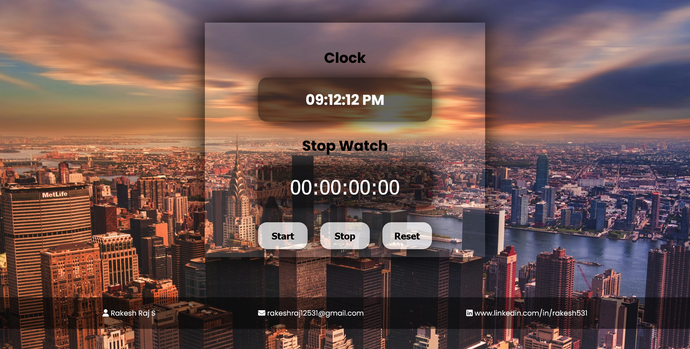

# 🕰️ Clock + Stopwatch Web App ⏱️💥

This ain’t your grandpa’s clock. 
This is a **clean, modern, dual-purpose Clock + Stopwatch** web app, handcrafted by the frontend wizard myself — **Rakesh Raj S.** 🧙‍♂️✨  
Made with spicy **HTML**, **CSS**, and **JavaScript**, and served fresh from the dev cauldron. 🍲🔥

---

## 🌄 Sneak Peek – Project Preview 🖼️

🌀 *Minimal UI. Crystal clear digits. Looks good on a potato pc too.* 🥔📱

---

## 🎥 Full Walkthrough – YouTube Demo 🎬

▶️ **Watch the Live Demo in Action:**  
🔗 [https://youtu.be/PTSG5OilZJo](https://youtu.be/PTSG5OilZJo)

*Seriously, just hit play. It’s smoother than your last relationship.* 💔💅

---

## 🌐 Live Demo – Click & See the Magic ✨

🚀 Try it now on any device:  
🔗 [https://rakesh12531.github.io/clock_project/](https://rakesh12531.github.io/clock_project/)

*Why wait for time to pass when you can code it instead?* ⏳👨‍💻

---

## 💎 Features – It’s Giving: Functional + Fabulous 😎

⏰ Real-Time Clock – updates live every second  
⏱️ Functional Stopwatch – Start, Stop, Reset buttons  
🎨 Simple UI – no BS, just clean design  
⚡ Fast Load – lightweight and snappy  
🧠 Beginner Friendly – easy to understand, easy to slay

---

## 🧰 Tech Stack – Tools of the Time Lord 🧪

🧱 **HTML** – For structure  
🎨 **CSS** – For styling & layout  
🧠 **JavaScript** – For all the logic and time sorcery  
📡 **Font Awesome** – For those spicy icons  
🌍 **GitHub Pages** – Because we deploy in style 😎

---

## 👨‍💻 Author – Time Travelled by...

Made with ⌛ & ❤️ by **Rakesh Raj S.**  
Frontend developer, IoT ninja, code juggler & full-time timekeeper 🕵️‍♂️

📧 Email: [rakeshraj12531@gmail.com](mailto:rakeshraj12531@gmail.com)  
🔗 LinkedIn: [linkedin.com/in/rakesh531](https://www.linkedin.com/in/rakesh531)  
🐙 GitHub: [github.com/rakeshraj531](https://github.com/rakeshraj531)

---

## 🚀 Wanna Use This ?

Fork it, clone it, remix it, vibe with it — your call 🔥  
Drop a ⭐ if it ticked your timebox, and show some love on the video 🙌  
Cuz feedback is the real stopwatch ⏱️ of growth 🧠

---

